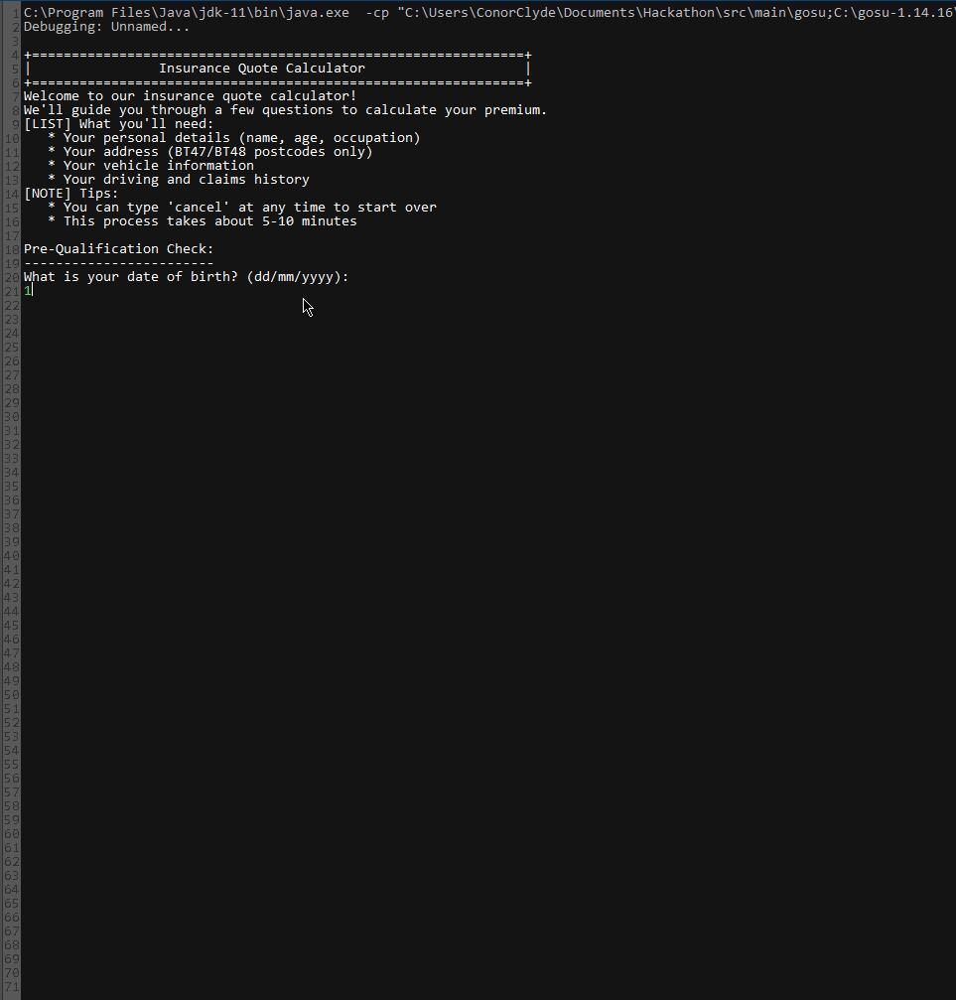
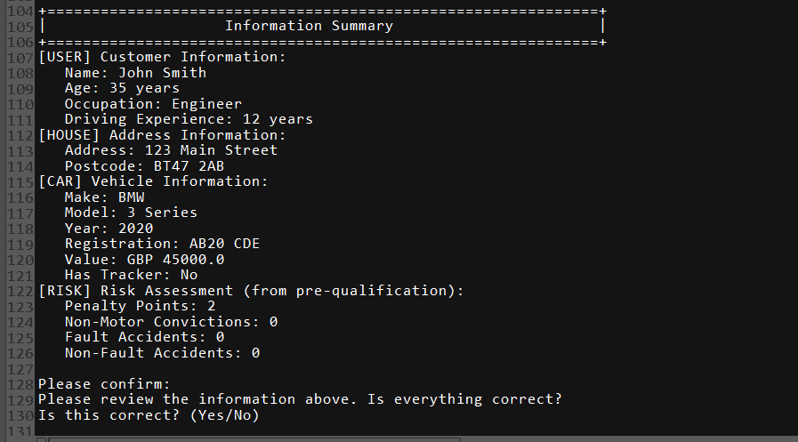
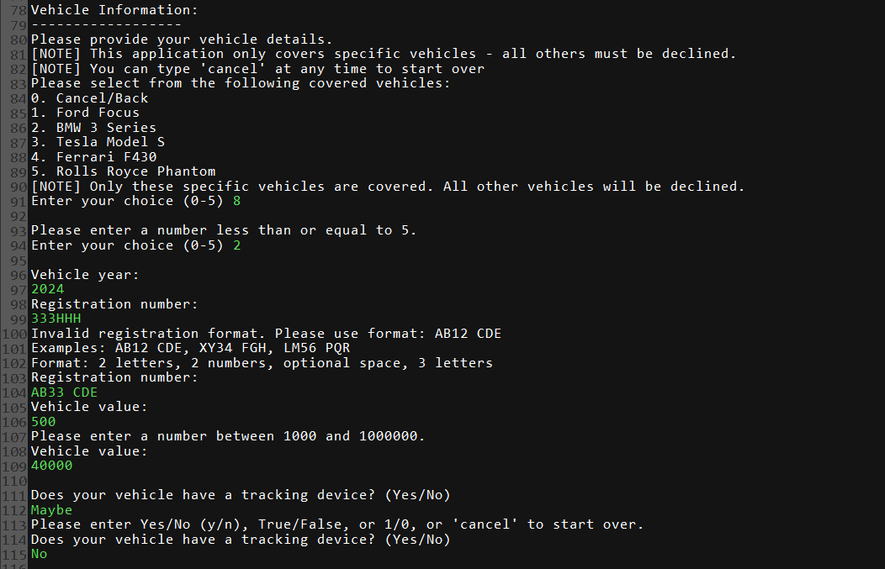

# 🚗 Insurance Quote Calculator
[](https://gosu-lang.github.io/)
[](https://openjdk.java.net/)
[](LICENSE)
[]()

A console-based insurance quote calculator built with Gosu. Implements real-world insurance business rules, validation, and clean architecture patterns — designed as a professional-grade learning project during a graduate program, and refined through continuous improvement.
b
## ✨ Features
- Pre-qualification with risk assessment
- Customer, vehicle & address data collection with validation
- Premium calculation with discounts, surcharges & tax
- Clean architecture (MVC, Strategy, Factory, Orchestrator)
- Comprehensive error handling & user-friendly flow

## 🎬 Demo & Screenshots

### **Complete Demo**
<br>
From pre-qualification to final premium calculation

### **User Journey**
| Step                                       | Screenshot                                                  | Description                                                     |
| ------------------------------------------ | ----------------------------------------------------------- | --------------------------------------------------------------- |
| **1. Pre-Qualification & Risk Assessment** |    | Eligibility check with **age, occupation, and risk validation** |
| **2. Customer Information Collection**     |     | Streamlined collection of **personal details** with validation  |
| **3. Vehicle Configuration**               |     | Configure **vehicle details and options** with validation       |
| **4. Information Summary & Confirmation**  |  | Review and confirm all **collected data & risk assessment**     |
| **5. Quote Calculation & Results**         |        | Detailed **premium breakdown** with accurate calculations       |

### **Technical Features**

#### **Validation & Error Handling**

**Pre-Qualification Validation**
<br>
*Input format validation and business rule enforcement during pre-qualification*

**Vehicle Configuration Validation**
<br>
*Range validation and option selection validation for vehicle configuration*

---

## 🚀 Quick Start

### Prerequisites
- **Java 11+**
- **Gosu 1.14.16** - [Download here](https://gosu-lang.github.io/downloads.html)

### Run the Project
1. Clone the repo
git clone https://github.com/conor-clyde/alchemy-gosu-hackathon.git
cd Hackathon

2. Open in Gosu IDE
# File → Open Project → Select Hackathon.prj

3. Run the app
▶️ Run button or run RunMe.gsp

## 📁 Project Structure

```
src/main/gosu/
├── app/                          # Application layer
│   ├── ApplicationController.gs  # Main orchestrator
│   ├── QuoteFlowController.gs    # Quote workflow
│   └── RunMe.gsp                 # Entry point
├── collector/                    # Data collection
│   ├── AddressCollector.gs       
│   ├── CustomerCollector.gs    
│   └── VehicleCollector.gs      
├── constants/                    # Configuration
│   └── Constants.gs              
├── domain/                       # Data models
│   ├── Address.gs                
│   ├── ClaimsHistory.gs         
│   ├── Customer.gs              
│   ├── DrivingHistory.gs        
│   ├── PreQualResult.gs          
│   ├── Quote.gs                  
│   ├── Vehicle.gs               
│   └── VehicleOption.gs         
├── service/                      # Business logic
│   ├── BusinessRuleValidator.gs  
│   ├── QuoteDataOrchestrator.gs  
│   └── ValidationEngine.gs       
└── util/                         # Utilities
    └── InputHandler.gs           
```

## 🏗️ Architecture & Design Patterns
- MVC → Domain entities (Model), Console UI (View), Controllers
- Factory → Vehicle options & pre-qualification results
- Strategy → Validation & business rule strategies
- Orchestrator → QuoteDataOrchestrator coordinates data flow
- Single Source of Truth → PreQualResult stores all risk data

## 💼 Business Rules
- Pre-Qualification: Age (21–85), postcode (BT47/BT48), penalty points (≤6), no convictions, limited accidents, occupation restrictions
- Premium Calculation:
- - Base £300 minimum
  - Discounts: profession (10%), experience (5%), postcode (5%)
  - Penalties: penalty points (20–50%), accidents (50–100%), vehicle type (up to 500%)
  - Tax: Insurance Premium Tax (12%)
- Vehicles Covered: Ford Focus, BMW 3 Series, Tesla Model S, Ferrari F430, Rolls Royce Phantom

## 🎮 User Experience Features

### **Optimized Flow**
1. **Pre-Qualification** - Comprehensive eligibility check with risk assessment
2. **Data Collection** - Streamlined information gathering with pre-populated data
3. **Confirmation** - Review and confirm all details with restart options
4. **Quote Calculation** - Premium calculation with accurate breakdown
5. **Acceptance** - Quote acceptance or restart options

### **Enhanced Error Handling**
- **Graceful Cancellation** - Users can cancel at any time
- **Clear Error Messages** - Specific validation feedback
- **Retry Options** - Restart from any point
- **Data Persistence** - No data loss during retries

### **User-Friendly Features**
- **Input Validation** - Real-time format checking
- **Confirmation Steps** - Review before proceeding
- **Restart Capability** - Start over from pre-qualification
- **Clear Messaging** - Professional, informative prompts

## 🔧 Technical Implementation

### **Language Features Used**
- **Gosu Classes** - Object-oriented design
- **Type Safety** - Strong typing throughout
- **Exception Handling** - Comprehensive error management
- **Collections** - Lists, Maps, and Sets
- **Date/Time** - LocalDate for age and license calculations

### **Key Algorithms**
- **Premium Calculation**: Base + discounts - penalties + tax (with accurate display)
- **Age Calculation**: Period.between() for accurate age computation
- **Validation Logic**: Regex patterns and business rule enforcement
- **Data Flow**: Optimized orchestrated collection with single source of truth

### **Performance Considerations**
- **Efficient Validation** - Early exit on validation failures
- **Memory Management** - Optimized object lifecycle with minimal variables
- **User Experience** - Minimal input requirements, smart defaults
- **Data Efficiency** - Single source of truth eliminates redundancy

## Validation
- Input validation (dates, postcodes, names, ranges)
- Business rule enforcement (age, location, accidents, vehicles)
- Graceful error handling with retries & clear messages

## 🎯 Learning Outcomes
- Technical: Gosu mastery, clean architecture, validation engines, business rules
- Professional: Refactoring, documentation, problem solving, code quality
### **Technical Skills**
- **Gosu Language Mastery** - Advanced language features and best practices
- **Software Architecture** - Design patterns and clean code principles
- **Business Logic Implementation** - Real-world rule engine development
- **User Experience Design** - Console-based application UX
- **Error Handling** - Comprehensive exception management

### **Professional Development**
- **Project Management** - Self-directed development and iteration
- **Code Quality** - Refactoring and continuous improvement
- **Documentation** - Clear, comprehensive project documentation
- **Problem Solving** - Debugging and issue resolution

## 🤝 Contributing
This project has completed its purpose for learning, but you are very welcome to use it in your own way:
- Fork the repository and adapt it for your own projects
- Use the code as a reference for learning Gosu, clean architecture, and business logic design
- Open issues for bugs or documentation improvements
- Submit pull requests if you’d like to suggest enhancements
🔒 Direct contributions to the main branch are restricted — only forks and pull requests are accepted.

## 📄 License

This project is licensed under the MIT License - see the [LICENSE](LICENSE) file for details.

## 🙏 Acknowledgments

- **Guidewire** - For language/IDE
- **Graduate Program** - For the initial project opportunity

---

Built with ❤️ during a graduate program and refined through continuous learning.
Explore the code, learn Gosu, and see how real-world insurance rules can be modeled with clean architecture.
