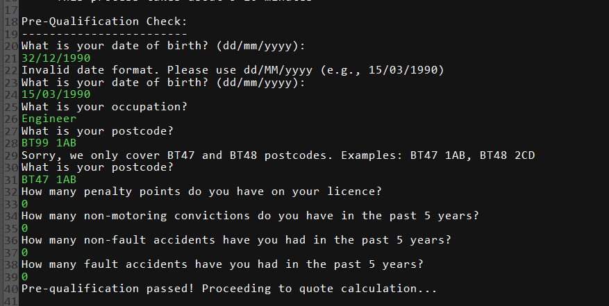

# 🚗 Insurance Quote Calculator

[](https://gosu-lang.github.io/) [](https://openjdk.java.net/) [](LICENSE) []()

A **console-based insurance quote calculator** built with Gosu and Java. Implements **real-world insurance rules**, validation, and clean architecture. Developed during a graduate program and refined for professional-grade learning.

---

## 📌 Table of Contents
- [Features](#-features)  
- [Demo & Screenshots](#-demo--screenshots)  
- [Quick Start](#-quick-start)  
- [Architecture & Design Patterns](#-architecture--design-patterns)  
- [Business Rules](#-business-rules)  
- [User Experience](#-user-experience)  
- [Technical Implementation](#-technical-implementation)  
- [Learning Outcomes](#-learning-outcomes)  
- [Contributing](#-contributing)  
- [License](#-license)  

---

## ✨ Features
- ✅ Pre-qualification with **risk assessment**  
- ✅ Customer, vehicle & address **data collection with validation**  
- ✅ **Premium calculation** with discounts, surcharges & tax  
- ✅ **Clean architecture**: MVC, Strategy, Factory, Orchestrator  
- ✅ Comprehensive **error handling** & user-friendly flow  

---

## 🎬 Demo & Screenshots

<details>
<summary>Click to expand full demo & screenshots</summary>

### Complete Demo


### User Journey

| Step | Screenshot | Description |
|------|------------|-------------|
| **1. Pre-Qualification** |  | Eligibility check: **age, occupation, risk factors** |
| **2. Customer Info** |  | Collects **personal details** |
| **3. Vehicle Configuration** |  | Configure **vehicle details & options** |
| **4. Summary & Confirmation** |  | Review all collected data |
| **5. Quote Calculation** |  | Detailed **premium breakdown** |

#### Validation & Error Handling

| Feature | Screenshot | Description |
|---------|------------|-------------|
| Pre-Qualification Validation |  | Validates **dates, names, postcodes**, enforces eligibility rules |
| Vehicle Configuration Validation |  | Checks **ranges** and validates vehicle options |

</details>

---

## 🚀 Quick Start

### Prerequisites
- Java 11+  
- Gosu 1.14.16 → [Download](https://gosu-lang.github.io/downloads.html)

### Run the Project
```bash
git clone https://github.com/conor-clyde/alchemy-gosu-hackathon.git
cd Hackathon

### Run the Project
1. Clone the repo
git clone https://github.com/conor-clyde/alchemy-gosu-hackathon.git
cd Hackathon

2. Open in Gosu IDE
# File → Open Project → Select Hackathon.prj

3. Run the app
▶️ Run button or run RunMe.gsp
```

## 📁 Project Structure

```
src/main/gosu/
├── app/                          # Application layer
│   ├── ApplicationController.gs  # Main orchestrator
│   ├── QuoteFlowController.gs    # Quote workflow
│   └── RunMe.gsp                 # Entry point
├── collector/                    # Data collection
│   ├── AddressCollector.gs       
│   ├── CustomerCollector.gs    
│   └── VehicleCollector.gs      
├── constants/                    # Configuration
│   └── Constants.gs              
├── domain/                       # Data models
│   ├── Address.gs                
│   ├── ClaimsHistory.gs         
│   ├── Customer.gs              
│   ├── DrivingHistory.gs        
│   ├── PreQualResult.gs          
│   ├── Quote.gs                  
│   ├── Vehicle.gs               
│   └── VehicleOption.gs         
├── service/                      # Business logic
│   ├── BusinessRuleValidator.gs  
│   ├── QuoteDataOrchestrator.gs  
│   └── ValidationEngine.gs       
└── util/                         # Utilities
    └── InputHandler.gs           
```

## 🏗️ Architecture & Design Patterns
- MVC → Domain entities (Model), Console UI (View), Controllers
- Factory → Vehicle options and pre-qualification results
- Strategy → Validation and business rules
- Orchestrator → QuoteDataOrchestrator coordinates workflow
- Single Source of Truth → PreQualResult stores all risk data

## 💼 Business Rules
- Pre-Qualification: Age (21–85), postcode (BT47/BT48), penalty points (≤6), no convictions, limited accidents, occupation restrictions
- Premium Calculation:
  - Base: £300 minimum
  - Discounts: profession (10%), experience (5%), postcode (5%)
  - Penalties: penalty points (20–50%), accidents (50–100%), vehicle type (up to 500%)
  - Tax: Insurance Premium Tax (12%)
- Vehicles Covered: Ford Focus, BMW 3 Series, Tesla Model S, Ferrari F430, Rolls Royce Phantom

## 🎮 User Experience Features
- Optimized Flow: Pre-qualification → Data Collection → Confirmation → Quote Calculation → Acceptance
- Enhanced Error Handling: Graceful cancellation, clear messages, retry options, data persistence
- User-Friendly Features: Input validation, confirmation steps, restart capability, professional prompts

## 🔧 Technical Implementation
- Gosu Classes & Type Safety
- Exception Handling & Validation Engine
- Collections & Date/Time (LocalDate)
- Key Algorithms: Premium calculation, age calculation, validation logic, orchestrated data flow
- Performance: Efficient validation, memory optimization, minimal input requirements

## 🎯 Learning Outcomes
- Technical Skills: Gosu mastery, clean architecture, validation engines, business rules
- Professional Development: Refactoring, documentation, problem-solving, project management

---

## 🤝 Contributing
This project has completed its purpose for learning, but you are very welcome to use it in your own way:
- Fork the repository & adapt for your projects
- Use as reference for Gosu, clean architecture, and business rules
- Open issues for bugs or documentation improvements
- Submit pull requests for enhancements
🔒 Direct contributions to main branch restricted — use forks & PRs

---

## 📄 License
MIT License — see  [LICENSE](LICENSE) file for details.

---

## 🙏 Acknowledgments

- **Guidewire** - Language and IDE
- **Graduate Program** - Initial project opportunity

---

Built with ❤️ during a graduate program. Explore the code to see real-world insurance rules modeled with clean architecture.
