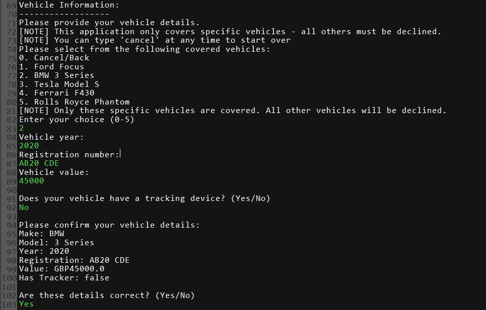

# 🚗 Insurance Quote Calculator

> **A comprehensive, interactive insurance quote calculator built in Gosu with real-world business rules, risk assessment, and premium calculation.**

[](https://gosu-lang.github.io/)
[](https://openjdk.java.net/)
[](LICENSE)
[]()

## 🎬 Demo & Screenshots

### **Application Flow Demo**
<br>
*Complete walkthrough of the insurance quote calculation process*

### **Key Screenshots**

#### **Pre-Qualification Check**
<br>
*Initial eligibility assessment with age, occupation, and risk validation*

#### **Data Collection Process**
<br>
*Customer information collection with validation examples*

<br>
*Vehicle selection and configuration with bounds validation*

#### **Quote Calculation Results**
<br>
*Detailed premium breakdown with discounts, penalties, and tax calculations*

### **Project Structure Overview**
<br>
*Clean, modular architecture with separation of concerns*

---

## 🏆 Project Overview

A sophisticated insurance quote calculator that demonstrates advanced business logic implementation, comprehensive data validation, and professional software architecture. Built as a learning project to master the Gosu programming language while implementing real-world insurance industry rules and calculations.

### ✨ Key Features

- **🎯 Complete Insurance Workflow** - End-to-end quote calculation with comprehensive data collection
- **⚖️ Advanced Business Rules** - Real-world insurance validation and risk assessment
- **🏗️ Professional Architecture** - Clean, modular design with separation of concerns
- **🛡️ Robust Error Handling** - Graceful error recovery and user-friendly feedback
- **✅ Comprehensive Validation** - Input validation, business rule enforcement, and data integrity
- **💰 Premium Calculation** - Sophisticated pricing with discounts, penalties, and tax calculations
- **🔄 User Experience** - Intuitive flow with confirmation steps and restart options

## 🚀 Quick Start

### Prerequisites

- **Java 11 or higher**
- **Gosu 1.14.16** - [Download here](https://gosu-lang.github.io/downloads.html)

### Installation

1. **Clone the repository**
   ```bash
   git clone https://github.com/conor-clyde/Insurance-Quote-Calculator.git
   cd Insurance-Quote-Calculator
   ```

2. **Set up Gosu environment**
   ```bash
   # Add Gosu to your PATH
   export PATH=$PATH:/path/to/gosu-1.14.16/bin
   ```

3. **Run the application**
   ```bash
   java -cp "src/main/gosu;path/to/gosu-libs/*" gw/lang/Gosu -fqn app.RunMe
   ```

## 📁 Project Structure

```
src/main/gosu/
├── app/                          # Application layer
│   ├── ApplicationController.gs  # Main application orchestrator
│   ├── QuoteFlowController.gs    # Quote collection workflow
│   └── RunMe.gsp                 # Application entry point
├── collector/                    # Data collection layer
│   ├── AddressCollector.gs       # Address data collection
│   ├── ClaimsHistoryCollector.gs # Claims history collection
│   ├── CustomerCollector.gs      # Customer data collection
│   ├── DrivingHistoryCollector.gs # Driving history collection
│   └── VehicleCollector.gs       # Vehicle data collection
├── constants/                    # Configuration
│   └── Constants.gs              # Business rules and constants
├── domain/                       # Data models
│   ├── Address.gs                # Address entity
│   ├── ClaimsHistory.gs          # Claims history entity
│   ├── Customer.gs               # Customer entity
│   ├── DrivingHistory.gs         # Driving history entity
│   ├── PreQualResult.gs          # Pre-qualification result
│   ├── Quote.gs                  # Quote and premium calculation
│   ├── Vehicle.gs                # Vehicle entity
│   └── VehicleOption.gs          # Vehicle options
├── service/                      # Business logic layer
│   ├── BusinessRuleValidator.gs  # Business rule validation
│   ├── QuoteDataOrchestrator.gs  # Data orchestration
│   └── ValidationEngine.gs       # Input validation engine
└── util/                         # Utilities
    └── InputHandler.gs           # User input handling
```

## 🏗️ Architecture & Design Patterns

### **MVC Pattern**
- **Model**: Domain entities (`Customer`, `Vehicle`, `Quote`, etc.)
- **View**: Console-based user interface
- **Controller**: `ApplicationController` and `QuoteFlowController`

### **Factory Pattern**
- `VehicleOption` factory for creating vehicle selections
- `PreQualResult` factory for pre-qualification outcomes

### **Strategy Pattern**
- Validation strategies in `ValidationEngine`
- Business rule strategies in `BusinessRuleValidator`

### **Orchestrator Pattern**
- `QuoteDataOrchestrator` coordinates data collection across multiple collectors

## 💼 Business Rules & Features

### **Pre-Qualification Checks**
- ✅ Age validation (21-85 years)
- ✅ Geographic restrictions (BT47/BT48 postcodes only)
- ✅ Penalty points validation (≤ 6 points)
- ✅ Non-motoring convictions check
- ✅ Accident history validation
- ✅ Occupation restrictions

### **Premium Calculation**
- **Base Premium**: £300 minimum
- **Discounts**: Professional occupation (10%), driving experience (5%), postcode (5%)
- **Penalties**: Penalty points (20-50%), vehicle type (0-500%), accidents (50-100%)
- **Tax**: Insurance Premium Tax (12%)

### **Vehicle Coverage**
- **Covered Vehicles**: Ford Focus, BMW 3 Series, Tesla Model S, Ferrari F430, Rolls Royce Phantom
- **Tracker Requirements**: Vehicles over £100,000 must have tracking devices
- **Value Limits**: £1,000 - £1,000,000

### **Risk Assessment**
- **Penalty Points**: 0-6 points allowed, surcharges apply
- **Accidents**: 0-3 non-fault, 0-2 fault accidents allowed
- **Convictions**: No non-motoring convictions allowed
- **Age Restrictions**: 21-85 years old

## 🎮 User Experience Features

### **Intuitive Flow**
1. **Pre-Qualification** - Quick eligibility check
2. **Data Collection** - Structured information gathering
3. **Confirmation** - Review and confirm all details
4. **Quote Calculation** - Premium calculation with breakdown
5. **Acceptance** - Quote acceptance or restart options

### **Error Handling**
- **Graceful Cancellation** - Users can cancel at any time
- **Clear Error Messages** - Specific validation feedback
- **Retry Options** - Restart from any point
- **Data Persistence** - No data loss during retries

### **User-Friendly Features**
- **Input Validation** - Real-time format checking
- **Confirmation Steps** - Review before proceeding
- **Restart Capability** - Start over from pre-qualification
- **Clear Messaging** - Professional, informative prompts

## 🔧 Technical Implementation

### **Language Features Used**
- **Gosu Classes** - Object-oriented design
- **Type Safety** - Strong typing throughout
- **Exception Handling** - Comprehensive error management
- **Collections** - Lists, Maps, and Sets
- **Date/Time** - LocalDate for age and license calculations

### **Key Algorithms**
- **Premium Calculation**: Base + discounts - penalties + tax
- **Age Calculation**: Period.between() for accurate age computation
- **Validation Logic**: Regex patterns and business rule enforcement
- **Data Flow**: Orchestrated collection with validation at each step

### **Performance Considerations**
- **Efficient Validation** - Early exit on validation failures
- **Memory Management** - Proper object lifecycle management
- **User Experience** - Minimal input requirements, smart defaults

## 🧪 Testing & Validation

### **Input Validation**
- **Date Formats** - DD/MM/YYYY validation
- **Postcodes** - UK postcode format validation
- **Names** - Character and length validation
- **Numbers** - Range and type validation

### **Business Rule Validation**
- **Age Requirements** - 21-85 years old
- **Geographic Coverage** - BT47/BT48 postcodes only
- **Risk Assessment** - Penalty points, convictions, accidents
- **Vehicle Coverage** - Specific makes and models only

## 📈 Project Evolution

### **Development Phases**
1. **Initial Development** - Basic quote calculator during graduate program
2. **Architecture Refinement** - Improved code structure and patterns
3. **User Experience Enhancement** - Better flow and error handling
4. **Business Logic Completion** - Comprehensive validation and calculation
5. **Final Polish** - Documentation and code cleanup

### **Key Improvements Made**
- ✅ **Eliminated Redundant Input** - Pre-qualification data flows through the system
- ✅ **Enhanced Error Messages** - Clear, actionable feedback
- ✅ **Improved User Flow** - Logical progression with confirmation steps
- ✅ **Better Architecture** - Clean separation of concerns
- ✅ **Comprehensive Validation** - Robust business rule enforcement

## 🎯 Learning Outcomes

### **Technical Skills**
- **Gosu Language Mastery** - Advanced language features and best practices
- **Software Architecture** - Design patterns and clean code principles
- **Business Logic Implementation** - Real-world rule engine development
- **User Experience Design** - Console-based application UX
- **Error Handling** - Comprehensive exception management

### **Professional Development**
- **Project Management** - Self-directed development and iteration
- **Code Quality** - Refactoring and continuous improvement
- **Documentation** - Clear, comprehensive project documentation
- **Problem Solving** - Debugging and issue resolution

## 🤝 Contributing

This project was developed as a learning exercise and is currently in a completed state. However, if you're interested in the codebase or have suggestions, feel free to:

- **Fork the repository** for your own learning
- **Open issues** for bugs or improvements
- **Submit pull requests** for enhancements
- **Use as reference** for Gosu development

## 📄 License

This project is licensed under the MIT License - see the [LICENSE](LICENSE) file for details.

## 🙏 Acknowledgments

- **Gosu Language Team** - For the excellent programming language
- **Graduate Program** - For the initial project opportunity
- **Insurance Industry** - For the business domain knowledge
- **Open Source Community** - For inspiration and best practices

---

**Built with ❤️ during a graduate program and refined through continuous learning and improvement.**

*This project demonstrates professional software development practices while providing a practical, real-world application of insurance quote calculation.* 
